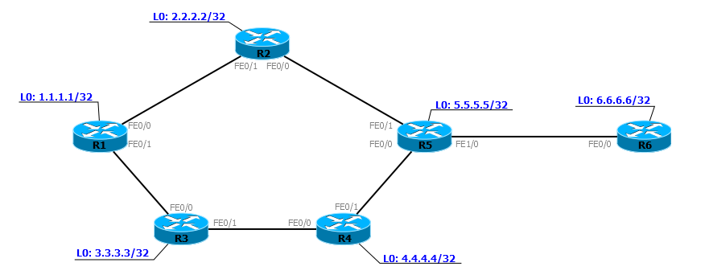
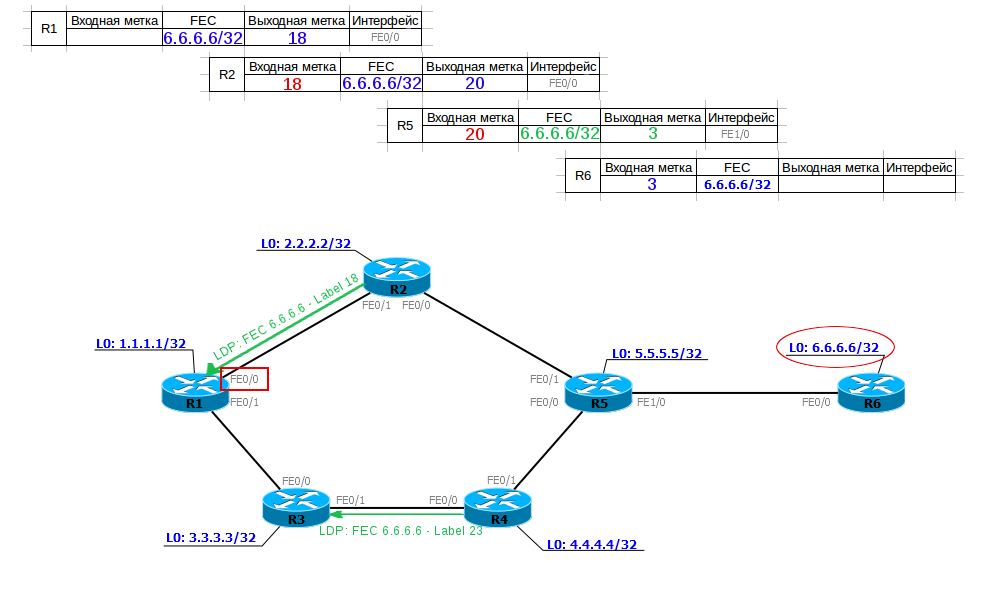
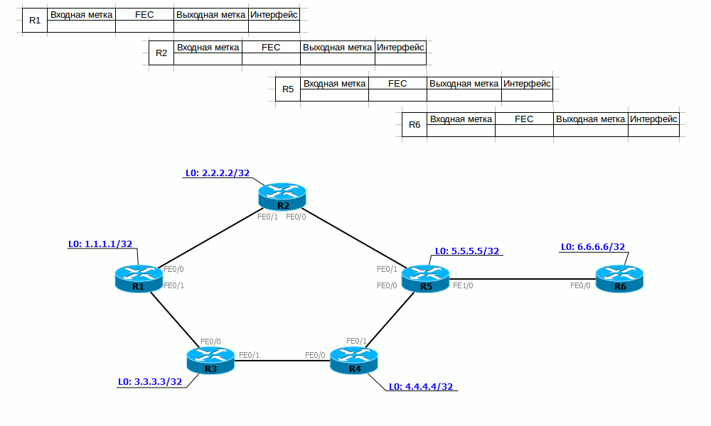

### LDP

Протокол с очень прозрачным названием — **Labed Distribution Protocol** — имеет соответствующий принцип работы.  
Рассмотрим его на сети linkmeup, которую мы мурыжим весь выпуск:

**1.** После включения LDP LSR делает мультикастовую рассылку UDP-дейтаграмм во все интерфейсы на адрес 224.0.0.2 и порт 646, где активирован LDP — так происходит поиск соседей.  
TTL таких пакетов равен 1, поскольку LDP-соседство устанавливается между непосредственно подключенными узлами.

> Вообще говоря, это не всегда так — LDP сессия может устанавливаться для определённых целей и с удалённым узлом, тогда это называется tLDP — [Targeted LDP](http://lookmeup.linkmeup.ru/#term511). О нём мы поговорим в других выпусках.

\_  
Такие сообщения называются **Hello**.

**2.** Когда соседи обнаружены, устанавливается TCP соединение с ними, тоже по порту 646 — **Initialization**. Дальнейшие сообщения \(кроме Hello\) передаются уже с TTL равным 255.

**3.** Теперь LSR периодически обмениваются сообщениями **Keepalive** адресно по TCP и по-прежнему не оставляют попыток найти соседей с помощью Hello.

**4.** В какой-то момент один из LSR обнаруживает в себе вторую личность — Egress LSR — то есть он является выходным для какого-то FEC. Это факт, о котором нужно сообщить миру.  
В зависимости от режима он ждёт запроса на метку для данного FEC, либо рассылает его сразу же.

Эта информация передаётся в сообщении **Label Mapping Message**. Исходя из названия, оно несёт в себе соответствие FEC и метки.

R5 получает информацию о соответствии FEC 6.6.6.6/32 и метки 3 \(implicit null\) и записывает её в свою таблицу меток. Теперь, когда ему нужно будет отправить данные на 6.6.6.6 он будет знать, что нужно удалить верхний заголовок MPLS и отправить оставшийся пакет в интерфейс FE1/0.

Далее он выбирает входную метку для данного FEC, записывает эту информацию в свою таблицу меток и отправляет её вышестоящим соседям.

Теперь R5 знает, что если пришёл пакет MPLS с меткой 20, его нужно передать в интерфейс FE1/0, сняв метку, то есть выполнив процедуру PHP.

R2 получает от R5 информацию о соответствии FEC-метка \(6.6.6.6 — 20\), вносит её в таблицу и, создав свою входную метку \(18\), передаёт её ещё выше. И так далее, пока все LSR не получат свою выходную метку.

Таким образом у нас построен LSP от R1 до R6. R1 при отправке пакета на 6.6.6.6/32 добавляет к нему метку 18 \(Push Label\) и посылает его в порт FE0/0. R2, получив пакет с меткой 18, меняет метку на 20 \(Swap Label\) и отправляет его в порт FE0/0. R5 видит, что для пакета с меткой 20, надо выполнить PHP \(выходная метка — 3 — implicit null\), снимает метку \(Pop Label\) и отправляет данные в порт FE1/0.

При этом параллельно оказались построены LSP от R2 до R6, от R5 до R6, от R4 до R6 итд. То есть ото всех LSR — просто я не показал это на иллюстрации.

Если у вас хватит сил, то на гифке ниже можно весь процесс посмотреть в динамике.

Естественно, вы понимаете, что не только R6 вдруг начал рассылать свои соответствия FEC-метка, но и все другие — R1 про 1.1.1.1/32, R2 — 2.2.2.2/32 итд. Все эти сообщения молниеносно разносятся по сети MPLS, строя десятки LSP. В результате каждый LSR будет знать про все существующие FEC и будет построен соответствующий LSP.

Опять же на гифке выше процесс показан не до конца, R1 потом передаёт информацию на R3, R3 на R4, R4 на R5.  
И если мы посмотрим на R5, то увидим, что для FEC 6.6.6.6/32 у нас не одна выходная метка, как ожидалось, а 3:

Более того, сам R6 запишет метку для FEC 6.6.6.6, которую получит от R5:

_Inuse_ — правильная — **imp-null** в сторону R6. Но две других из кольца — от R2 и R4. Это не ошибка и не петля — просто R2 и R4 сгенерировали эти метки для известного им из таблицы маршрутизации FEC 6.6.6.6/32.

Возникает два вопроса:  
1\) Как он планирует ими воспользоваться? Они же бестолковые. Ответ: а никак. Не может быть в нашей сети такой ситуации, когда 2.2.2.2 или 4.4.4.4 будут следующими узлами на пути к 6.6.6.6 — IGP так маршрут не построит. А значит и использованы метки не будут. Просто LDP-то глупый — его сообщения разбредаются по всей сети, пробиваясь в каждую щёлочку. А умный LSR уже решит каким пользоваться.  
2\) Что насчёт петель? Не будут сообщения LDP курсировать по сети пока TTL не истечёт?  
А тут всё просто — получение нового сообщения Label Mapping Message не инициирует создание нового — полученное соответствие просто записывается в таблицу LDP. То есть в нашем случае R5 уже придумал один раз метку для FEC 6.6.6.6/32 и разослал её своим вышестоящим соседям и она уже не поменяется, пока процесс LDP не перезагрузится.  
\_

> Возможно, вы уже заметили, что при настройке LDP есть возможность включить функционал Loop Detection, но спешу вас успокоить — это для сетей, где нет TTL, например, ATM. Этот функционал переключит LDP в режим DoD.

\_  
Это базовая информация о том, как работает LDP.  
На самом деле здесь всё очень сильно зависит от производителя. В принципе LDP поддерживает всевозможные режимы работы с метками: и DoD/DU, и Independent Control/Ordered Control, и Conservative/Liberal Label Retention. Это никак не регламентируется RFC, поэтому каждый вендор волен выбирать свой путь.  
Например, в основном все используют DU для LDP, но при этом в Juniper метки раздаются упорядоченно, а в Cisco независимо.  
В качестве FEC в Huawei и Juniper выбираются только Loopback-интерфейсы LSR, а Cisco FEC создаётся для всех записей в таблице маршрутизации.

Но это всё едва ли как-то отразится на реальной сети.

Самое важное, что нужно понимать относительно LDP — он не использует в своей работе протоколы динамической маршрутизации — по принципу работы он похож на [PIM DM](https://linkmeup.ru/tag/сети%20для%20самых%20маленьких/#PIM-DM): наводняет всю сеть метками, но при этом он опирается на информацию из таблицы маршрутизации LSR. И если на R1 придёт две метки для одного FEC от разных соседей, то он выберет для LSP только ту, которая получена через лучший интерфейс до этого FEC по информации из ТМ.  
Это означает три вещи:

* Вы вольны выбирать IGP, который вам больше нравится, хоть RIP .
* LDP всегда строит только один \(лучший\) маршрут и не может построить, например, резервный.
* При изменении топологии сети LSP перестроится в соответствии с обновившейся таблицей маршрутизации, то есть сначала должен сойтись IGP, и только потом поднимется LSP.

И вообще после включения LDP трафик будет ходить так же, как и без него, с той лишь разницей, что появляются метки MPLS.  
В том числе LDP, как и IP, поддерживает [ECMP](http://lookmeup.linkmeup.ru/#term435), просто алгоритмы вычисления хэша, а соответственно и балансировки могут отличаться.

Интересная [статья](http://blog.ipspace.net/2011/11/junos-versus-cisco-ios-mpls-and-ldp.html) от Ивана Пепельняка на тему LDP и [видео](http://blog.ipspace.net/2014/10/tech-talks-introduction-to-label.html) о том, как протокол работает.

LDP описан в [RFC 5036](https://tools.ietf.org/html/rfc5036).
