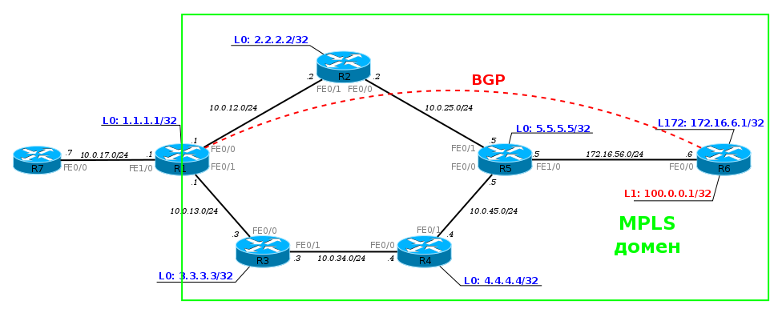

### MPLS и BGP

До сих пор мы говорили о том как MPLS взаимодействует с IGP-протоколами. Мы убедились, что ничего сложного в этом нет и что настройки также довольно простые.

Но самое интересное кроется во взаимодействии MPLS с BGP. В этом выпуске мы лишь слегка затронем эту тему. Но в следующих, мы поговорим подробнее о том, какую роль играет BGP, и как с помощью него и MPLS мы можем организовывать различные типы VPN.  
Сейчас же нам надо разобраться как MPLS и BGP взаимодействуют на самом базовом уровне.

Главное отличие BGP от IGP заключается в том, что MPLS не создает метки для маршрутов BGP. Если вспомнить о том, какое количество маршрутов передает BGP, то становится понятно, что это очень хорошая идея. Как же тогда состыковать MPLS и BGP?  
Все просто:

1. создаем метки только для адресов, которые будут указаны как next-hop для маршрутов, которые мы получаем по BGP \(тут надо не забыть про next-hop-self для IBGP-соседей\).
2. Когда нашему Ingress LSR понадобится передать пакеты по маршруту, который был получен по BGP, отправляем их к next-hop, который указан в маршруте и используем ту метку, которая была создана для него.

Теперь, вместе того чтобы настраивать BGP на каждом маршрутизаторе в нашей AS, мы можем настраивать его только на пограничных маршрутизаторах, к которым подключены клиенты или другие провайдеры.

Посмотрим на примере сети:  

Если нам надо добраться с R1 до сетей Филькин Сертификат, мы смотрим, что они доступны через R6 и «пролетаем» через MPLS до адреса 6.6.6.6. А когда мы добираемся до R6, он уже знает куда идти дальше. Аналогично будет и наоборот, в Балаган-Телеком.

Конфигурацию для этой схемы и пару команд с выводом информации, можно найти по [ссылке](https://docs.google.com/document/d/19ehYnTkg4Y-NvGyxWAzPm4c2vhTTL_dIZRNvwkAahk4/pub).

> [**Задача № 4**](https://linkmeup.ru/blog/158.html)  
>   
> В сети настроены MPLS и OSPF. MPLS настроен во всей сети, кроме соединения между R7 и R1.  
> Между маршрутизаторами R1-R2-R3-R4-R5-R6 трафик должен передаваться силами MPLS.  
> В сети также настроен BGP, который работает между R1 и R6.  
>   
> Для маршрутов BGP не генерируются метки.  
> Для того чтобы R1 мог добраться до маршрутов, которые получены по BGP от R6, пакеты передаются средствами MPLS до IP-адреса, который указан как next-hop в маршрутах BGP.  
>   
> Сейчас с R7 недоступен маршрут, который анонсируется по BGP маршрутизатором R6.  
>   
> **Задание:**  
> Восстановить работу сети, чтобы с R7 пинговался адрес 100.0.0.1.  
>   
> **Ограничения:**  
> Нельзя менять настройки BGP.  
>   
> **Схема**   
>   
> Подробности задачи и конфигурации узлов [тут](https://linkmeup.ru/blog/158.html).
