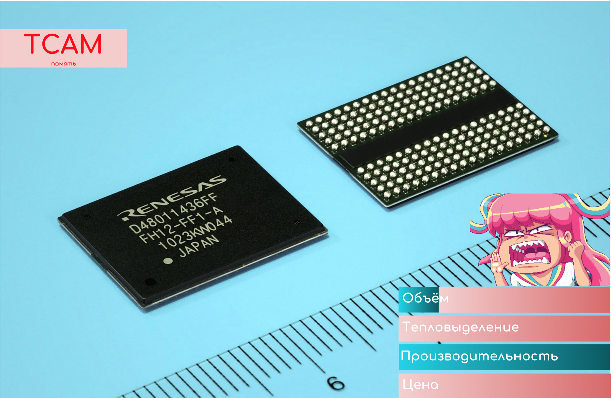
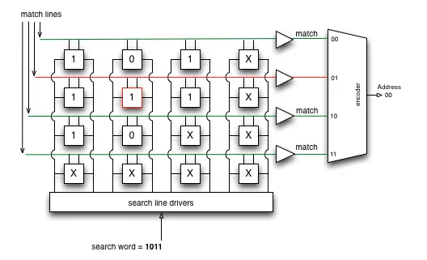

# TCAM — Ternary Content-Addressable Memory

Возвращаемся к вопросу, что не так с IP.  
Если мы возьмём описанный выше CAM, то на любой [DIP](http://lookmeup.linkmeup.ru/#term53) он очень редко сможет вернуть 1 во всех битах.  
Дело в том, что DIP — это всегда один единственный адрес, а маршруты в таблице маршрутизации — это подсеть или даже агрегация более мелких маршрутов. Поэтому полного совпадения быть почти не может — кроме случая, когда есть маршрут /32.  
Перед разработчиками чипов стояло два вопроса:

* Как это в принципе реализовать?
* Как из нескольких подходящих маршрутов выбрать лучший \(с длиннейшей маской\)?



Ответом стал TCAM, в котором **«T»** означает «троичный»". Помимо **0** и **1** вводится ещё одно значение **Х** — «не важно» \(CAM иногда называют BCAM — Binary, поскольку там значения два — 0 и 1\).  
Тогда результатом поиска нужной записи в таблице коммутации будет содержимое той ячейки, где самая длинная цепочка 1 и самая короткая «не важно».  
Например, пакет адресован на DIP 10.10.10.10.  
В Таблице Маршрутизации у нас следующие маршруты:

```text
0.0.0.0/0
10.10.10.8/29
10.10.0.0/16
10.8.0.0/13
Другие.
```

В сравнивающие элементы TCAM записываются биты маршрута, если в маске стоит 1, и «не важно», если 0.  
При поиске нужной записи TCAM, как и CAM, прогоняет искомое значение одновременно по всем ячейкам. Результатом будет последовательность 0, 1 и «не важно».  
Только те записи, которые вернули последовательность единиц, за которыми следуют «не важно» участвуют в следующем этапе селекции.  
Далее из всех результатов выбирается тот, где самая длинная последовательность единиц — так реализуется правило Longest prefix match.  
Очевидно, что мы-то своим зорким взглядом, сразу увидели, что это будет маршрут 10.10.10.8/29.



[Источник картинки](http://thenetworksherpa.com/tcam-in-the-forwarding-engine/).

Решение на грани гениальности, за которое пришлось заплатить большую цену. Из-за очень высокой плотности транзисторов \(у каждой ячейки их свой набор, а ячеек должны быть миллионы\) они греются не меньше любого CPU — нужно решать вопрос отвода тепла.  
Кроме того, их производство стоит очень дорого, и не будет лукавством сказать, что стоимость сетевого оборудования и раньше и сейчас определяется именно наличием и объёмом TCAM.

Внимательный читатель обратил внимание на вопрос хэш-функций — ведь она преобразует изначальный аргумент во что-то совершенно непохожее на исходник, как же мы будем сравнивать 0, 1 и длины? Ответ: хэш функция здесь не используется. Описанный выше алгоритм — это сильное упрощения реальной процедуры, за деталями этого любознательного читателя отправлю к той же книге [Hardware Defined Networking](https://www.juniper.net/uk/en/training/jnbooks/distinguished-engineering/hardware-defined-networking/).

Однако память — это память — всего лишь хранит. Сама она трафик не передаёт — кто-то с ней должен взаимодействовать.

> Автору не удалось найти общепринятые термины для обозначения тех или иных компонентов, поэтому он взял на себя смелость пользоваться собственным терминологическим аппаратом. Однако он готов в любой момент прислушаться к рекомендациям и адаптировать статью к универсальным определениям.

Тот компонент, который занимается передачей пакетов, называется чипом коммутации — **FE — Forwarding Engine**. Именно он парсит заголовки, запрашивает информацию в TCAM и перенаправляет пакеты к выходному интерфейсу.  
Работа с пакетом декомпозируется на множество мелких шагов, каждый из которых должен выполняться на скорости линии, и совокупное время отработки тракта должно быть адекватным требованиям сети.  
Реализован FE может быть на Сетевых Процессорах \(NP\), FPGA и элементарных ASIC или их последовательности.

Вот с элементарных ASIC и начнём.

