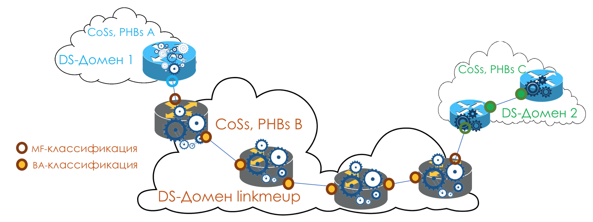

# 4. Классификация и маркировка

```text
Внутри своей сети администратор определяет классы сервиса, которые он может предоставлять трафику.
```

Поэтому первое, что делает каждый узел при получении пакета, проводит его классификацию.

```text
Существует три способа:
```

1. \*\*\*\*[**Behavior Aggregate** \(**BA**\)](behavior-aggregate.md) Просто довериться имеющейся маркировке пакета в его заголовке. Например, полю IP DSCP. Называется он так, потому что под одной меткой в поле DSCP агрегированы различные категории трафика, которые ожидают одинакового по отношению к себе поведения. Например, все SIP-сессии будут агрегированы в один класс. Количество возможных классов сервиса, а значит и моделей поведения, ограничено. Соответственно нельзя каждой категории \(или тем более потоку\) выделить отдельный класс — приходится агрегировать.
2. \*\*\*\*[**Interface-based**](interface-based.md) Всё, что приходит на конкретный интерфейс, помещать в один класс трафика. Например, мы точно знаем, что в этот порт подключен сервер БД и больше ничего. А в другой рабочая станция сотрудника.
3. \*\*\*\*[**MultiField** \(**MF**\)](multi-field.md) Проанализировать поля заголовков пакета — IP-адреса, порты, MAC-адреса. Вообще говоря, произвольные поля. Например, весь трафик, который идёт в подсеть 10.127.721.0/24 по порту 5000, нужно маркировать как трафик, условно, требующий 5-й класс сервиса.

```text
Администратор определяет набор классов сервиса, которые сеть может предоставлять, и сопоставляет им некоторое цифровое значение.  

На входе в DS-домен мы никому не доверяем, поэтому проводится классификация вторым или третьим способом: на основе адресов, протоколов или интерфейсов определяется класс сервиса и соответствующее цифровое значение.  

На выходе из первого узла эта цифра кодируется в поле DSCP заголовка IP \(или другое поле Traffic Class: MPLS Traffic Class, IPv6 Traffic Class, Ethernet 802.1p\) — происходит ремаркировка.  

Внутри DS-домена принято доверять этой маркировке, поэтому транзитные узлы используют первый способ классификации \(BA\) — наиболее простой. Никакого сложного анализа заголовков, смотрим только записанную цифру.   

На стыке двух доменов можно классифицировать на основе интерфейса или MF, как я описал выше, а можно довериться маркировке BA с оговорками.
```

Например, доверять всем значениям, кроме 6 и 7, а 6 и 7 перемаркировывать в 5.  
Такая ситуация возможна в случае, когда провайдер подключает юрлицо, у которого есть своя политика маркировки. Провайдер не возражает сохранить её, но при этом не хочет, чтобы трафик попадал в класс, в котором у него передаются пакеты сетевых протоколов.



