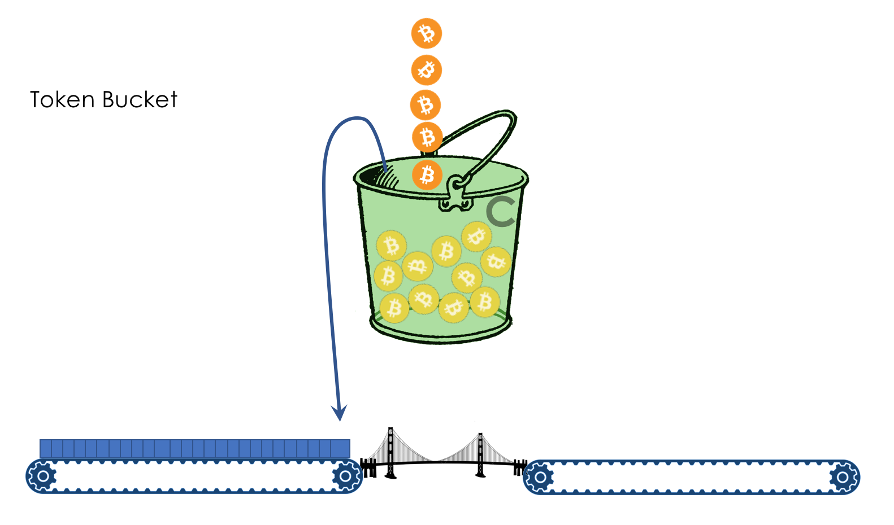
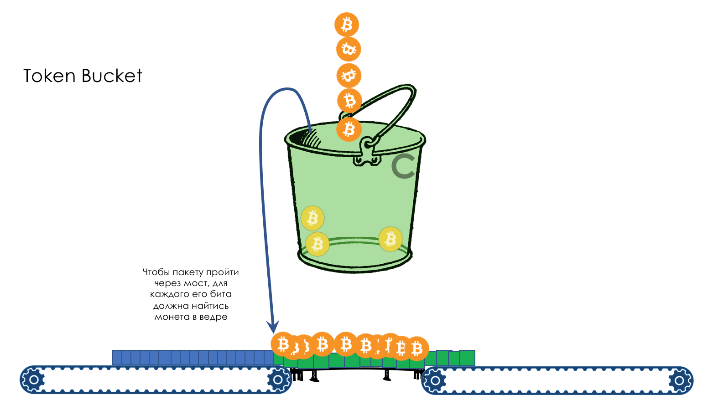
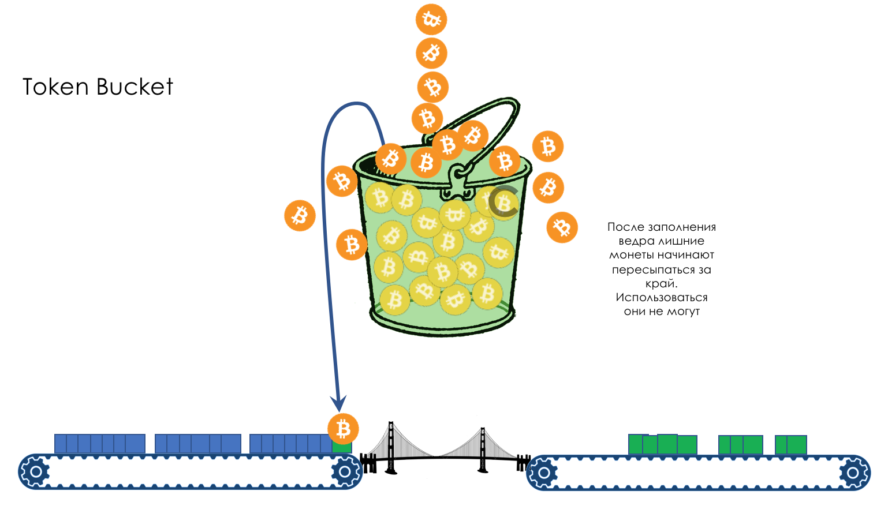
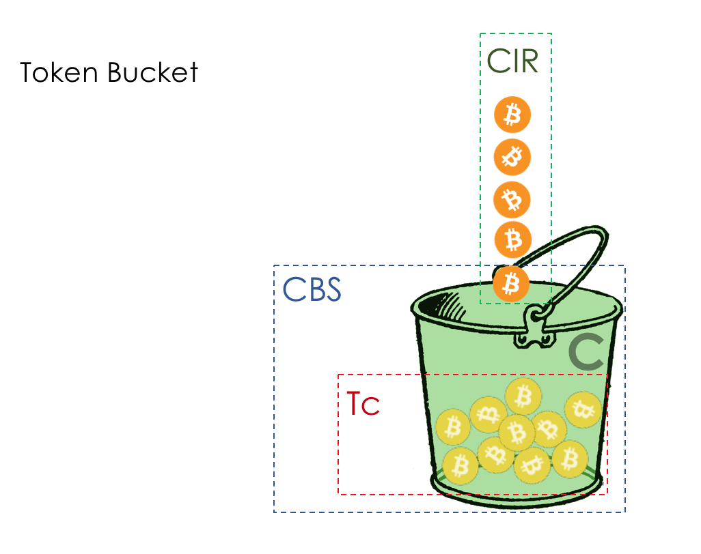
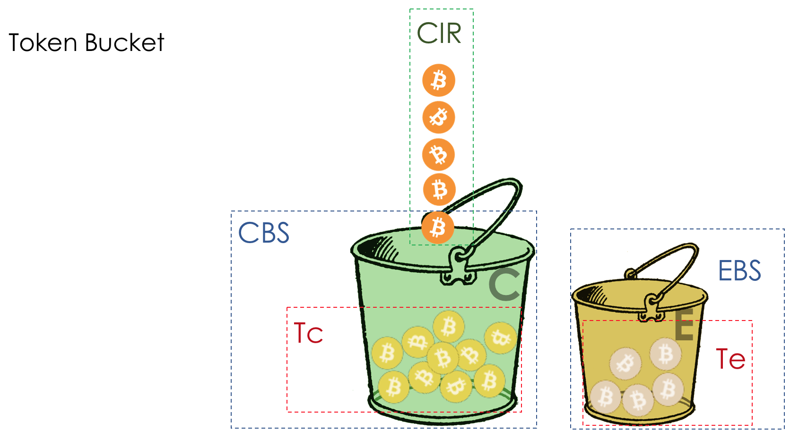
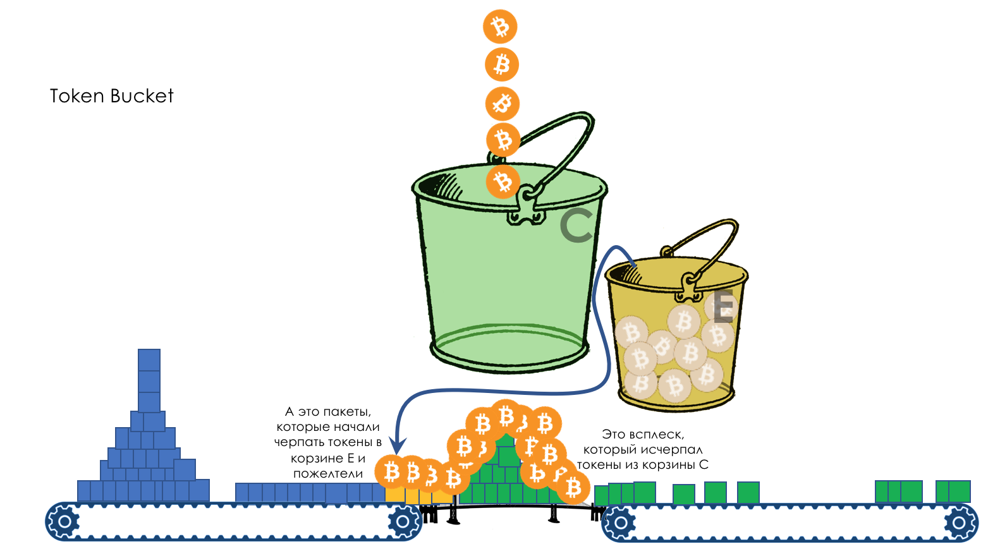
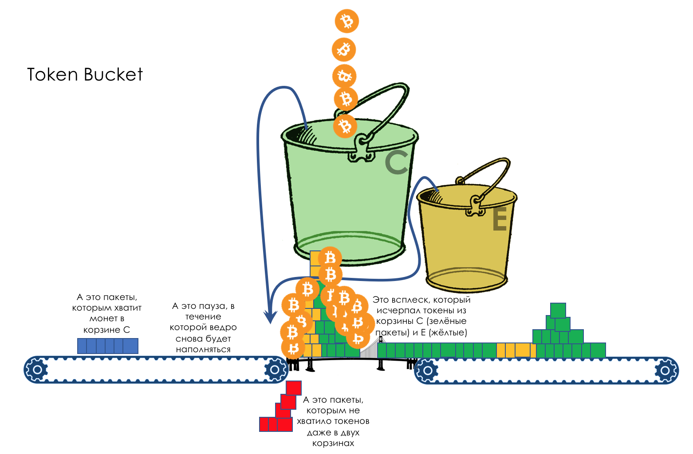
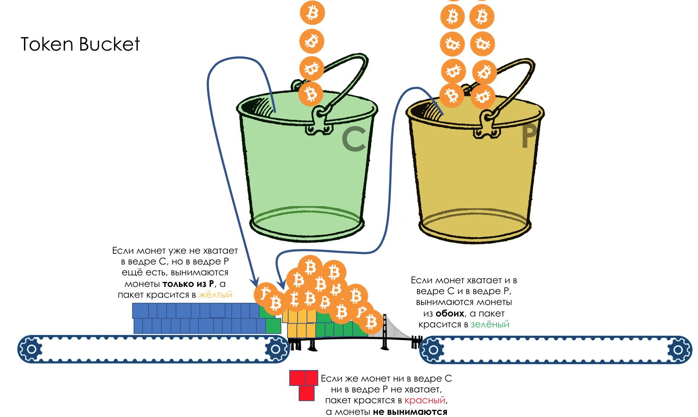

# Алгоритм Token Bucket

Многие считают, что Token Bucket и Leaking Bucket — одно и то же. Сильнее ошибался только Эйнштейн, добавляя космологическую постоянную.  
Чипы коммутации не очень-то хорошо понимают, что такое время, ещё хуже они считают сколько битов они за единицу времени передали. Их работа — молотить.

Вот этот приближающийся бит — это ещё 400 000 000 бит в секунду или уже 400 000 001?


Перед разработчиками ASIC стояла нетривиальная инженерная задача.

Её разделели на две подзадачи:  
1\) Собственно ограничение скорости путём отбрасывания лишних пакетов на основе очень простого условия. Выполняется на чипах коммутации  
2\) Создание этого простого условия, которым занимается более сложный \(более специализированный\) чип, ведущий счёт времени.

Алгоритм, решающий вторую задачу называется Token Bucket. Его идея изящна и проста \(нет\).

Задача Token Bucket — пропускать трафик, если он укладывается в ограничение и отбрасывать/красить в красный, если нет.

При этом важно разрешить всплески трафика, поскольку это нормальное явление.  
И если в Leaky Bucket всплески амортизировались буфером, то Token Bucket ничего не буферизирует.

## **Single Rate — Two Color Marking**

Пока не обращайте внимания на название =\)

Имеем ведро, в которое падают монетки с постоянной скорость — 400 мегамонет в секунду, например.  
Объём ведра — 600 миллионов монет. То есть наполняется оно за полторы секунды.

Рядом проходят две ленты конвейера: одна подвозит пакеты, вторая — увозит.

Чтобы попасть на отвозящий конвейер, пакет должен заплатить.  
Монетки для этого он берёт из ведра в соответствии со своим размером. Грубо говоря — сколько битов — столько и монеток.





Если ведро опустело и монет пакету не хватило, он окрашивается в красный сигнальный цвет и отбрасывается. Увы-селявы. При этом монеты из ведра не вынимаются.


Следующему пакету монет уже может хватить — во-первых, пакет может быть поменьше, а, во-вторых, ещё монет за это время нападает.  
Если ведро уже полное, все новые монеты будут выбрасываться.



Всё зависит от скорости поступления пакетов и их размера.

Если она стабильно ниже или равна 400 Мб в секунду, значит монет всегда будет хватать.  
Если выше, то часть пакетов будет теряться.

Более конкретный пример с гифками, как мы все любим.


> * Есть ведро ёмкостью 2500 байтов. На начальный момент времени в нём лежит 550 токенов.  На конвейере три пакета по 1000 байтов, которые хотят быть отправлены в интерфейс. В каждый квант времени в ведро падает 500 байтов \(500\*8 = 4 000 бит/квант времени — ограничение полисера\).
> * На исходе первого кванта времени в ведро падает 500 токенов. И в это время подходит первый пакет. Его размер 1000 байтов, а в ведре 1050 токенов — **хватает**. Пакет красится в зелёный цвет и пропускается. 1000 токенов вынимается из ведра. В ведре остаётся 50 токенов.
> * На исходе второго кванта времени в ведро падает ещё 500 токенов — итого 550. А размер пришедшего пакета — 1000 — **не хватает**. Пакет красится красным и отбрасывается, токены не вынимаются.
> * На исходе третьего кванта в ведро падает ещё 500 токенов — снова 1050. Размер пришедшего пакета — 1000 — **хватает**. Пакет красится в зелёный и пропускается, токены вынимаются из ведра.
>
> Объём ведра в 2500 байтов фактически означает, что через такой полисер ни при каких условиях не пройдёт пакет больше 2500 байтов — ему никогда не будет хватать токенов. Поэтому его объём должен быть не меньше MTU и вообще рекомендуется объём, равный количеству трафика на максимальной скорости, разрешённой полисером, за 1,5-2 секунды.  
> То есть [формула](https://en.wikiquote.org/wiki/Stephen_Hawking#A_Brief_History_of_Time_%281988%29) следующая:  
>   
> CBS = CIR \(бит в секунду\)\*1,5 \(секунды\)/8 \(бит в байте\)  
>   
> Если вернуться к практическому [примеру по полисингу](../3-praktika-polising-i-sheiping.md), где мы настраивали всплески \(Bc\), то станет понятно, что при большом значении \(1 875 000 байтов\) все всплески амортизируются хорошо. А при маленьком \(10 000 байтов\), несмотря на то, что оно заметно больше MTU, полисер упирается в постоянное заполнение ведра и отбрасывает большое количество пакетов.

```text
Зачем ведру объём? Битовый поток не всегда равномерен, это очевидно. Ограничение в 400 Мб/с — это не асимптота — трафик может её пересекать. Объём хранящихся монет позволяет небольшим всплескам пролетать, не будучи отброшенными, однако среднюю скорость сохранить на уровне 400Мб/с.
```

Например, стабильный поток 399 Мб/с за 600 секунд позволит ведру наполниться до краёв.  
Далее трафик может подняться до 1000Мб/с и держаться на этом уровне 1 секунду — 600 Мм \(Мегамонет\) запаса и 400 Мм/с гарантированной полосы.  
Или же трафик может подняться до 410 Мб/с и держаться таким на протяжении 60 секунд.


То есть запас монет позволяет слегка выйти за ограничение на продолжительное время или выплеснуть короткий но высокий всплеск.

Теперь к терминологии.  
Скорость поступления монет в ведро — **CIR — Committed Information Rate** \(Гарантированная средняя скорость\). Измеряется в битах в секунду.  
Количество монет, которые могут храниться в ведре — **CBS — Committed Burst Size**. Разрешённый максимальный размер всплесков. Измеряется в байтах. Иногда, как вы уже могли заметить, называется **Bc**.  
**Tc** — Количество монет \(Token\) в ведре **C** \(CBS\) в данный момент.




В статье я использую термин "**Tc**", так же, как он использован в [RFC 2697](https://tools.ietf.org/html/rfc2697) \(_A Single Rate Three Color Marker_\).

Однако есть и другой **Tc**, который описывает интервал времени, когда в ведро ссыпается новая порция монет.

Здесь следует сделать отступление.

Невозможно подстроить скорость интерфейса, чтобы удовлетворить условиям полисера, поэтому и вводится система Token Bucket, реализующая по сути **TDM** \(Time-Division Multiplexing\) - она разрешает отправку трафика только в определённые моменты времени.

То есть монеты не льются в ведро непрерывным потоком — современный мир, увы, дискретен.

В первом приближении предлагается один раз в секунду насыпать CIR монет. Потом через секунду итд.

Это работает плохо, потому что всплеск — и секунда молчания, всплеск — и секунда молчания, всплеск — и секунда молчания.

Поэтому во втором приближении секунда делится на интервалы времени, в которые спускается определённое число монет.

Такой интервал времени тоже называется \(как минимум в литературе Cisco\) **Tc**, а количество падающих монет - **Bc**. При этом **Bc = CIR\*Tc** \(биты/с\*с\).

То есть в начале каждого интервала Tc в ведро опускается Bc монет.


Это самый простой сценарий. Он называется **Single Rate — Two Color**.

**Single Rate** означает, что есть только одна средняя разрешённая скорость, а **Two Color** — что можно покрасить трафик в один из двух цветов: зелёный или красный.

1. Если количество доступных монет \(бит\) в ведре **C** больше, чем количество бит, которые нужно пропустить в данный момент, пакет красится в зелёный цвет — низкая вероятность отбрасывания в дальнейшем. Монеты **изымаются** из ведра.
2. Иначе, пакет красится в красный — высокая вероятность дропа \(либо, чаще, сиюминутное отбрасывание\). Монеты при этом из ведра **С не изымаются**.

   Используется для полисинга в PHB CS и EF, где превышения по скорости не ожидается, но если оно произошло, то лучше сразу отбросить.

   Дальше рассмотрим посложнее: Single Rate — Three Color.

## **Single Rate — Three Color Marking**

Недостаток предыдущей схемы в том, что есть только два цвета. Что если мы не хотим отбрасывать всё, что выше средней разрешённой скорости, а хотим быть ещё более лояльными?

**sr-TCM** \(**Single Rate — Three Color Marking**\) вводит второе ведро в систему — **E**. На этот раз монеты, не поместившиеся в заполненное ведро **C**, пересыпаются в **E**.


К CIR и CBS добавляется **EBS — Excess Burst Size** — Разрешённый размер всплесков во время пиков. **Te** — количество монет в ведре **E**.



Допустим пакет размера **B** пришёл по конвейеру. Тогда

1. Если монет в ведре **C** хватает, пакет красится в зелёный и пропускается. Из ведра **C** вынимается **B** монет \(Остаётся: Tc — B\).
2. Если монет в ведре **C** не хватает, проверяется ведро **E**. Если в нём монет хватает, пакет красится в жёлтый \(средняя вероятность дропа\), из ведра **E** вынимается **B** монет.



1. Если и в ведре **E** не хватает монет, то пакет красится в красный, монеты не вынимаются ниоткуда.



Обратите внимание, что для конкретного пакета Tc и Te **не суммируются**.

То есть пакет размером 8000 байтов не пройдёт, даже если в ведре **C** будет 3000 монет, а в **E** — 7000. В **C** не хватает, в **E** не хватает — ставим красное клеймо — шуруй отсюда.

Это очень изящная схема. Весь трафик, который укладывается в среднее ограничение CIR+CBS \(автор знает, что нельзя так напрямую складывать биты/с и байты\) — проходит зелёным. В пиковые моменты, когда клиент исчерпал монеты в ведре **C**, у него есть ещё накопленный за время простоя запас Te в ведре **E**.

То есть можно пропустить чуть больше, но в случае заторов такие с большей вероятностью будут отброшены.  
sr-TCM описан в [RFC 2697](https://tools.ietf.org/html/rfc2697).  
Используется для полисинга в PHB AF.

Ну и последняя система — самая гибкая и потому сложная — Two Rate — Three Color.

## **Two Rate — Three Color Marking**

Модель **Tr-TCM** родилась из идеи, что не в ущерб другим пользователям и типам трафика, почему бы клиенту не дать чуть больше приятных возможностей, а ещё лучше продать.

Скажем ему, что ему гарантировано 400 Мб/с, а если есть свободные ресурсы, то 500. Готовы заплатить на 30 рублей больше?  
Добавляется ещё одно ведро **P**.

Таким образом:

**CIR** — гарантированная средняя скорость.  
**CBS** — тот же разрешённый размер всплеска \(объём ведра **C**\).  
**PIR** — Peak Information Rate — максимальная средняя скорость.  
**EBS** — разрешённый размер всплесков во время пиков \(Объём ведра **P**\).

В отличие от sr-TCM, в tr-TCM в оба ведра теперь независимо поступают монеты. В **C** — со скоростью CIR, в **P** — PIR.


Какие правила?

Приходит пакет размером **B** байтов.

1. Если монет в ведре **P** не хватает — пакет помечается красным. Монеты **не вынимаются**. Иначе:
2. Если монет в ведре **C** не хватает — пакет помечается жёлтым, и из ведра **P вынимаются B** монет. Иначе:
3. Пакет помечается зелёным и из **обоих вёдер вынимаются B** монет.



То есть правила в tr-TCM другие.

Пока трафик укладывается в гарантированную скорость, монеты вынимаются из обоих вёдер. Благодаря этому, когда в ведре **C** монеты кончатся, останутся в **P**, но ровно столько, чтобы не превысить PIR \(если бы вынимались только из **C**, то **P** наполнялось бы больше и давало гораздо бо́льшую скорость\).  
Соответственно, если он выше гарантированной, но ниже пиковой, монеты вынимаются только из **P**, потому что в **C** уже нет ничего.

tr-TCM следит не только за всплесками, но и за постоянной пиковой скоростью.  
tr-TCM описан в [RFC 2698](https://tools.ietf.org/html/rfc2698).

Тоже используется для полисинга в PHB AF.

