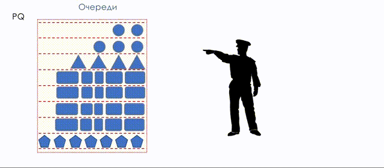

# PQ — Priority Queuing

```text
Второй по сложности механизм и попытка разделить сервис по классам — **приоритетная очередь**.
```

Трафик теперь раскладывается в несколько очередей согласно своему классу — приоритету \(например, хотя не обязательно, те же BE, AF1-4, EF, CS6-7\). Диспетчер перебирает одну очередь за другой.  
Сначала он пропускает все пакеты из самой приоритетной очереди, потом из менее, потом из менее. И так по кругу.  
Диспетчер не начинает изымать пакеты низкого приоритета, пока не пуста высокоприоритетная очередь.


```text
Если в момент обработки низкоприоритетных пакетов приходит пакет в более высокоприоритетную очередь, диспетчер переключаются на неё и только опустошив её, возвращается к другим.
```



```text
PQ работает почти так же в лоб, как FIFO.
```

Он отлично подходит для таких видов трафика, как протокольные пакеты и голос, где задержки имеют критическое значение, а общий объём не очень большой.  
Ну, согласитесь, не стоит придерживать BFD Hello из-за того, что пришли несколько больших видео-чанков с ютуба?  
Но тут и кроется недостаток PQ — если приоритетная очередь нагружена трафиком, диспетчер вообще никогда не переключится на другие.  
И если какой-то Доктор ЗЛО в поисках методов завоевания мира решит помечать весь свой злодейский трафик наивысшей чёрной меткой, все другие будут покорно ждать, а потом отбрасываться.  
О гарантированной полосе для каждой очереди говорить тоже не приходится.  
Высокоприоритетные очереди можно прирезать по скорости обрабатываемого в них трафика. Тогда другие не будут голодать. Однако контролировать это непросто.

```text
Следующие механизмы ходят по всем очередям по очереди, забирая из них некое количество данных, тем самым предоставляя более честные условия. Но делают они это по-разному.
```

