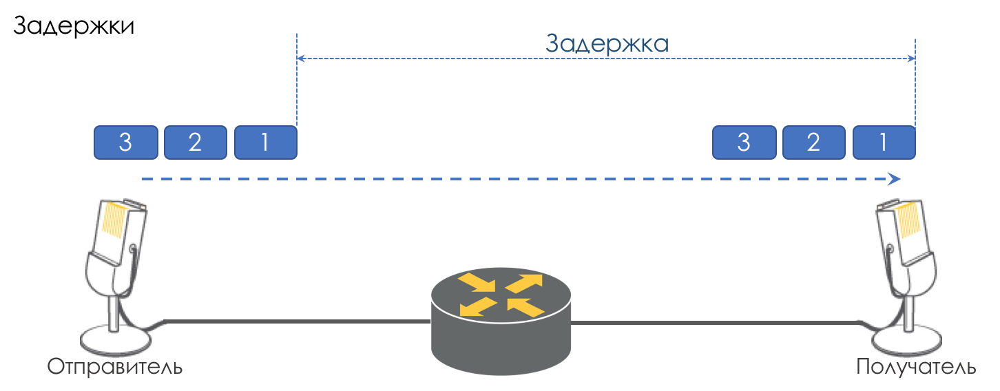

# Задержки

```text
Это время, которое необходимо данным, чтобы добраться от источника до получателя.
```



```text
Совокупная задержка складывается из следующих компонентов.
```

* **Задержка сериализации** \(**Serialization Delay**\) — время, за которое узел разложит пакет в биты и поместит в линк к следующему узлу. Она определяется скоростью интерфейса. Так, например, передача пакета размером 1500 байт через интерфейс 100Мб/с займёт 0,0001 с, а на 56 кб/с — 0,2 с.
* **Задержка передачи сигнала в среде** \(**Propagation Delay**\) — результат ограниченной скорости света. Физика не позволяет добраться из Нью-Йорка до Томска по поверхности планеты быстрее чем за 30 мс \(фактически порядка 70 мс\).
* **Задержки, вносимые QoS** — это томление пакетов в очередях \(**Queuing Delay**\) и последствия шейпинга \(**Shaping Delay**\). Об этом мы сегодня будем говорить много и нудно в главах [Управление перегрузками](https://github.com/gunzrun/SDSM/tree/a654c07e984b9fcd41ba764760f876f69326e61b/15.-qos/7.-upravlenie-peregruzkami-congestion-management) и [Ограничение скорости](https://github.com/gunzrun/SDSM/tree/a654c07e984b9fcd41ba764760f876f69326e61b/15.-qos/8.-ogranichenie-skorosti).
* **Задержка обработки пакетов** \(**Processing Delay**\) — время на принятие решения, что делать с пакетом: lookup, ACL, NAT, DPI, — и доставку его от входного интерфейса до выходного. Но с того дня, когда Juniper в своём M40 разделил Control и Data Plane, задержку обработки перестали брать во внимание, т.е. ей можно пренебречь.

Задержки не так страшны приложениям, где не требуется спешка: обмен файлами, сёрфинг, VoD, интернет-радиостанции и т.д. И напротив, они критичны для интерактивных: 200мс уже неприятны на слух при телефонном разговоре.

Связанный с задержкой термин, но не являющийся синонимом — **RTT** \(**Round Trip Time**\) — это путь туда-обратно. При пинге и трассировке вы видите именно RTT, а не одностороннюю задержку, хотя величины и имеют корреляцию.

